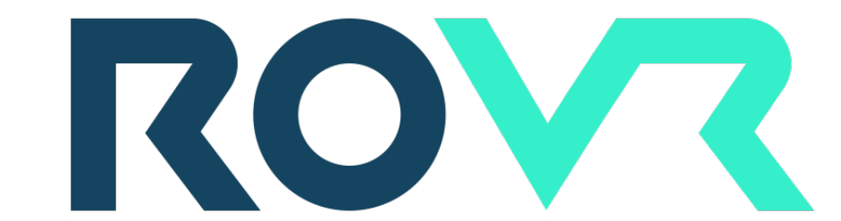
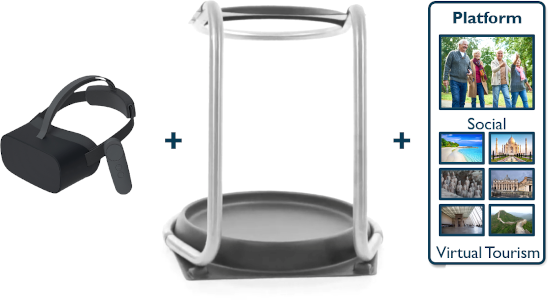

# ROVR Social VR Platform

## Overview

The social VR platform allows geographically distanced groups to meet in VR. The system is developed in Unreal Engine using the OnlineSubSystem peer to peer network functionality, which requires a known IP address for the host and related network settings (usually port forwarding and remove of firewall). Users are able to interate verbally through Vivox voice services - both direction audio and posional audio and enabled within this platform.

The Social Platform functions on both PC & Android (Pico Neo 2). 

### SDK Information 
Unreal Version : 4.25.3\
Vivox SDK Version : 5.13.0.unr.1\
Pico SDK Version : v1.2.3

## Features
To follow .....

## Contributors 
Jamie Pierce & Thomas Baker \
© Copyright Wizdish Ltd 2021

## Known Bugs/Fixes Required
- Android Movement - Fix rotation for HMD movement - TB SORTING
- PC VIVOX NOT WORKING - MAY NEED APPROPRIATE SDK
- VR Spawn Crashing - leaving lobby or joining gameplay 
- Backspace on VR keyboard deleting two characters when the button is pressed once
- Nametag in gameplay not working

## Additional Information
This repository does not include the Vivox Plugin requried for audio communication. Please ensure you copy a version of this into the Plugins folder before building. If building for PC ensure that the Pico SDK elements are not enabled in the Plugins window.

If you experience build errors, follow the steps below:

1.Delete the following folders: Binaries, Build, Intermediate, Saved\
2.Delete the Visual Studio or Xcode solution file (.sln or .xcodeproj)\
3.Right click on the uproject file and click 'Generate Visual Studio Files'\
4.Open the sln file and build the c++ project.\
5.Re-open Unreal

## Future Developments
- Awaiting Bug Fix No.6411 - issue relates to OnClick of the UI. Tracking here : https://issues.unrealengine.com/issue/UE-6411 (https://answers.unrealengine.com/questions/142589/view.html)
- Android Volume Needs Increasing - vivox positional values for volume close and drop off after
- Move vivox tokens over to production ready solutionw
- Allow users to upload own images
- PlayFab , Gamespark , AWS, Improbable IO - GameSparks for easy account creation/handling, cloud code, currency management, analytics, etc.)
