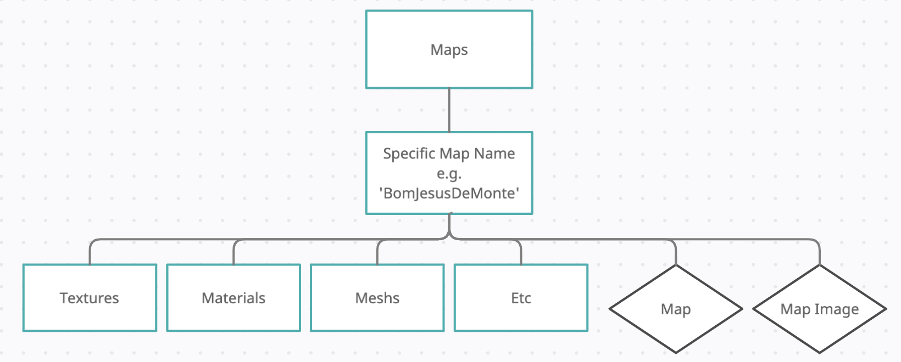

# ROVR Revitalise Social VR Platform

## Overview

The social VR platform allows geographically distanced groups to meet in VR. The system is developed in Unreal Engine using the OnlineSubSystem peer to peer network functionality, which requires a known IP address for the host and related network settings (usually port forwarding and remove of firewall). Users are able to interact verbally through Vivox voice services - both direction audio and posional audio and enabled within this platform.

The Social Platform functions on both PC & Android (Pico Neo 2). 

### Setup Instructions
- Make sure the floor level is correct within the Pico settings - this may require manually setting. 

### SDK Information 
Unreal Version : 4.26.1\
Vivox SDK Version : 5.13.0.unr.1\
Pico SDK Version : v1.2.5

## Features
To follow .....

## Contributors 
Jamie Pierce & Thomas Baker \
© Copyright Wizdish Ltd 2021

## Known Bugs/Fixes Required
- Vivox Positional Audio

## Map Directory
All maps are not saved to this repository, they can be found at the link below and should be loaded into the "Content/Maps" folder.
https://www.dropbox.com/sh/cgh18cymasrrs01/AABBoPfnFVLZDhnIslS1ENOVa?dl=0

When creating new map content, please create this in an independent project in the structure shown below keeping all assetts etc in the relative map folder - this alllows for easy migration onto the social platform. Please also make sure that the maps are full optimised for android and the Pico Neo2. 

## Additional Information
This repository does not include the Vivox Plugin requried for audio communication. Please ensure you copy a version of this into the Plugins folder before building. If building for PC ensure that the Pico SDK elements are not enabled in the Plugins window.

If you experience build errors, follow the steps below:

1.Delete the following folders: Binaries, Build, Intermediate, Saved\
2.Delete the Visual Studio or Xcode solution file (.sln or .xcodeproj)\
3.Right click on the uproject file and click 'Generate Visual Studio Files'\
4.Open the sln file and build the c++ project.\
5.Re-open Unreal

## Future Developments
- Mesh to stay with camera - to avoid mesh blocking widget interaction and player being out of the skeleton
- Awaiting Bug Fix No.6411 - issue relates to OnClick of the UI. Tracking here : https://issues.unrealengine.com/issue/UE-6411 (https://answers.unrealengine.com/questions/142589/view.html)
- Android Volume Needs Increasing - vivox positional values for volume close and drop off after
- Move vivox tokens over to production ready solution
- Allow users to upload own images
- PlayFab , Gamespark , AWS, Improbable IO - GameSparks for easy account creation/handling, cloud code, currency management, analytics, etc.)
- Allow users to select map folder from inside the application. For example, if a new map was released, they could download it and simply select the folder and the application would install the map for them.

Photon Intergration Notes:
- Tick every half second to update location
